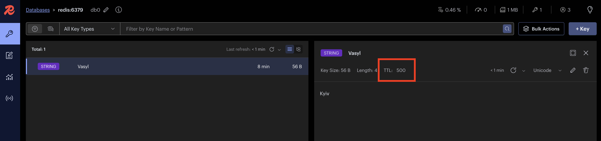
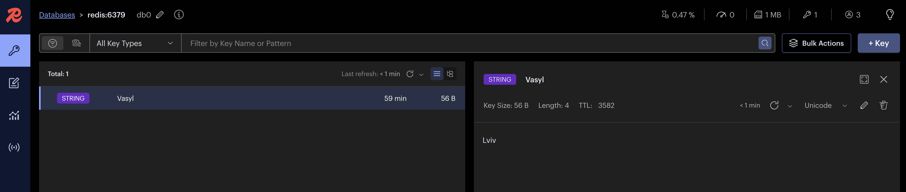

# HSA redis cluster

<h4>Redis Instance</h4>

Connect to container, set/get test key
```
docker exec -it {container_name} redis-cli

HSET user1 name "James" lastName "Smith" age 27 job "Software Developer"
HGETALL user1
```

<h4>Redis Sentinel</h4>

Redis Sentinel is a distributed system consisting of multiple Redis instances started in sentinel mode (called Sentinels). Monitoring of Redis Primary-Replica(s) work, automatic failover.


<h4>Redis Cluster</h4>

[Cluster specification](https://redis.io/docs/latest/operate/oss_and_stack/reference/cluster-spec/)


To perform their tasks all the cluster nodes are connected using a TCP bus and a binary protocol, called the Redis Cluster Bus.

Redis Cluster does not support multiple databases like the standalone version of Redis.

Show cluster nodes (when cluster mode is on)
```
127.0.0.1:6379> cluster nodes
```

<h3>Task</h3>

1. Build master-slave cluster
2. Try all eviction strategies
3. Implement Probabilistic cache cleaning

<h3>Homework</h3>

<h4>Run Redis in Master/Slave mode</h4>

Note: If master goes down, slave will keep trying connect master which will keeping the whole system crash.
```
docker-compose -f docker-compose-master-slave.yml up -d
```
Check primary/replica info
```
127.0.0.1:6379> info replication
```
 

<h4>Run Redis in Master/Slave mode with Sentinel</h4>

Sentinel will automatically detects the point of failure and bring the cluster back to stable mode.
```
docker-compose -f docker-compose-master-slave-sentinel.yml up -d
```
Note: after redis master was dropped, new master was chosen. However sentinel couldn't connect to new master node trying to resolve old host name 'redis-master'.

<h4>Redis Keys Eviction verification</h4>

[Key eviction strategies](https://redis.io/blog/cache-eviction-strategies/)

Default values are maxmemory=0 (no memory limits), maxmemory-policy=noeviction (returns an error when the memory limit is reached)

Get/set ``maxmemory``, ``maxmemory-policy`` values:
```
CONFIG GET maxmemory maxmemory-policy
CONFIG SET maxmemory 2mb
CONFIG SET maxmemory-policy allkeys-lru
```

Put data in cache with size > 1585kb

| Strategy      | Scenario                                                                                                                         |
|---------------|----------------------------------------------------------------------------------------------------------------------------------|
| noeviction    | Inserted 1016 from 1100 keys without TTL. Error received ``OOM command not allowed when used memory > 'maxmemory'.``             |
| allkeys-lru   | Inserted 100 without TTL, get first 10 keys. Added more keys, first key still present in cache, other keys were evicted.         |
| volatile-lru  | Inserted keys with and without TTL. Keys without TTL present in cache. Keys with TTL all cleaned.                                |
| allkeys-lfu   | Inserted 100 keys without TTL. Get key1 several times. Added more keys, other keys were evicted but key1 still present in cache. |
| volatile-ttl  | Inserted 10 keys with 2h TTL. Added more keys with 1h TTL, these keys were evicted, keys with 2h TTL still present in cache.     |

<h4>Probabilistic Cache eviction </h4>

Build app
```
./gradlew clean build
```

Run app, script will create database and insert test data
```
docker-compose up -d
```

Fill cache with default data from database, hit endpoint several times
```
GET http://localhost:8080/api/cache/probabilistic-value?cacheKey=Vasyl
Response: Kyiv
Response: Kyiv
Response: Kyiv
```

Update record in db to replace cache value fetched in endpoint (db client used):
```
update users set city = 'Lviv' where name = 'Vasyl'
```

Modify key TTL = 500 to be closer for setting ``early-refresh-period-sec: 300`` (redis insight client used)


Hit endpoint several times
```
GET http://localhost:8080/api/cache/probabilistic-value?cacheKey=Vasyl
Response: Kyiv
Response: Kyiv
Response: Kyiv
Response: Lviv
Response: Lviv
```

