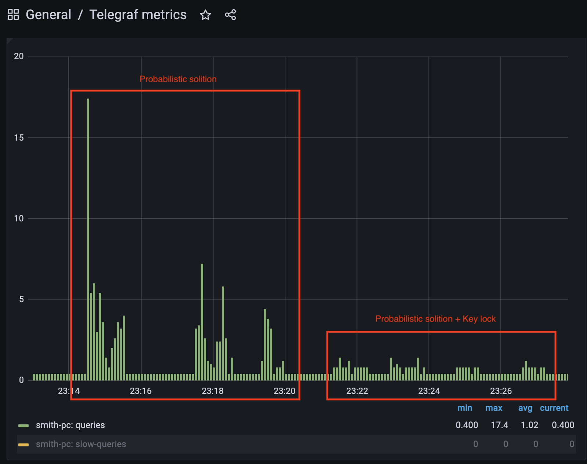

# HSA redis cluster

<h4>Redis Instance</h4>

Connect to container, set/get test key
```
docker exec -it {container_name} redis-cli

HSET user1 name "James" lastName "Smith" age 27 job "Software Developer"
HGETALL user1
```

<h4>Redis Sentinel</h4>

Redis Sentinel is a distributed system consisting of multiple Redis instances started in sentinel mode (called Sentinels). Monitoring of Redis Primary-Replica(s) work, automatic failover.


<h4>Redis Cluster</h4>

[Cluster specification](https://redis.io/docs/latest/operate/oss_and_stack/reference/cluster-spec/)


To perform their tasks all the cluster nodes are connected using a TCP bus and a binary protocol, called the Redis Cluster Bus. Redis Cluster does not support multiple databases like the standalone version of Redis.

Show cluster nodes (when cluster mode is on)
```
127.0.0.1:6379> cluster nodes
```

<h3>Task</h3>

1. Build master-slave cluster
2. Try all eviction strategies
3. Implement Probabilistic cache cleaning

<h3>Homework</h3>

<h4>Run Redis in Master/Slave mode</h4>

```
docker-compose -f docker-compose-master-slave.yml up -d
```
Note: If master goes down, slave will keep trying to connect master which will keeping the whole system crash.
```
2024-09-02 12:09:45 1:S 02 Sep 2024 09:09:45.336 * Connecting to MASTER redis-master:6379
2024-09-02 12:09:45 1:S 02 Sep 2024 09:09:45.343 # Unable to connect to MASTER: Operation now in progress
```

Check primary/replica info
```
127.0.0.1:6379> info replication
```
 

<h4>Run Redis in Master/Slave mode with Sentinel</h4>

Sentinel will automatically detects the point of failure and bring the cluster back to stable mode.
```
docker-compose -f docker-compose-master-slave-sentinel.yml up -d
```
Note: after redis master was dropped, new master was chosen. 
```
2024-09-02 12:16:26 1:S 02 Sep 2024 09:16:26.181 * Connecting to MASTER redis-master:6379
2024-09-02 12:16:26 1:S 02 Sep 2024 09:16:26.187 # Unable to connect to MASTER: Success
2024-09-02 12:16:27 1:M 02 Sep 2024 09:16:27.174 * Discarding previously cached master state.
2024-09-02 12:16:27 1:M 02 Sep 2024 09:16:27.174 * Setting secondary replication ID to 3011f2efb71c4acafe49799be924545727a1dc85, valid up to offset: 16641. New replication ID is 3df1f26b9b3cdab0bacbe0622c78cdb3c134b3d5
2024-09-02 12:16:27 1:M 02 Sep 2024 09:16:27.174 * MASTER MODE enabled (user request from 'id=3 addr=172.19.0.5:47368 laddr=172.19.0.3:6379 fd=13 name=sentinel-1d2dc3c5-cmd age=91 idle=0 flags=x db=0 sub=0 psub=0 ssub=0 multi=4 watch=0 qbuf=188 qbuf-free=20286 argv-mem=4 multi-mem=169 rbs=8192 rbp=5835 obl=45 oll=0 omem=0 tot-mem=29861 events=r cmd=exec user=default redir=-1 resp=2 lib-name= lib-ver=')
2024-09-02 12:16:27 1:M 02 Sep 2024 09:16:27.576 * Replica 172.19.0.4:6379 asks for synchronization
```

However sentinel couldn't connect to new master node trying to resolve old host name 'redis-master'.
```
2024-09-02 12:18:09 11:X 02 Sep 2024 09:18:09.660 # Failed to resolve hostname 'redis-master'
2024-09-02 12:18:10 11:X 02 Sep 2024 09:18:10.732 # Failed to resolve hostname 'redis-master'
```

<h4>Redis Keys Eviction verification</h4>

[Key eviction strategies](https://redis.io/blog/cache-eviction-strategies/)

Default values are ``maxmemory=0`` (no memory limits),`` maxmemory-policy=noeviction`` (returns an error when the memory limit is reached)

Get/set ``maxmemory``, ``maxmemory-policy`` values:
```
CONFIG GET maxmemory maxmemory-policy
CONFIG SET maxmemory 2mb
CONFIG SET maxmemory-policy allkeys-lru
```

Put data in cache with size > 1585kb

| Strategy      | Scenario                                                                                                                         |
|---------------|----------------------------------------------------------------------------------------------------------------------------------|
| noeviction    | Inserted 1016 from 1100 keys without TTL. Error received ``OOM command not allowed when used memory > 'maxmemory'.``             |
| allkeys-lru   | Inserted 100 without TTL, get first 10 keys. Added more keys, first key still present in cache, other keys were evicted.         |
| volatile-lru  | Inserted keys with and without TTL. Keys without TTL present in cache. Keys with TTL all cleaned.                                |
| allkeys-lfu   | Inserted 100 keys without TTL. Get key1 several times. Added more keys, other keys were evicted but key1 still present in cache. |
| volatile-ttl  | Inserted 10 keys with 2h TTL. Added more keys with 1h TTL, these keys were evicted, keys with 2h TTL still present in cache.     |

<h4>Probabilistic Cache eviction </h4>

Build app
```
./gradlew clean build
```

Run app, script will create database and insert test data
```
docker-compose up -d
```
<h4>Verification</h4>

There are 2 solutions provided:

1. Probabilistic cache refresh
```
GET http://localhost:8080/api/cache/probabilistic-value?cacheKey=Vasyl
./get-from-cache.sh
```
2. Probabilistic cache refresh + Key lock
```
http://127.0.0.1:8080/api/cache/probabilistic-value-with-lock?cacheKey=Vasyl
.get-from-cache-with-lock.sh
```

To compare solutions effectiveness, script is run during 60 sec together with scheduler which reset key TTL to 500 (early refresh) and initiates cache refreshing.

DB queries metrics show reducing calls to db confirming 'Key lock' improvement:




